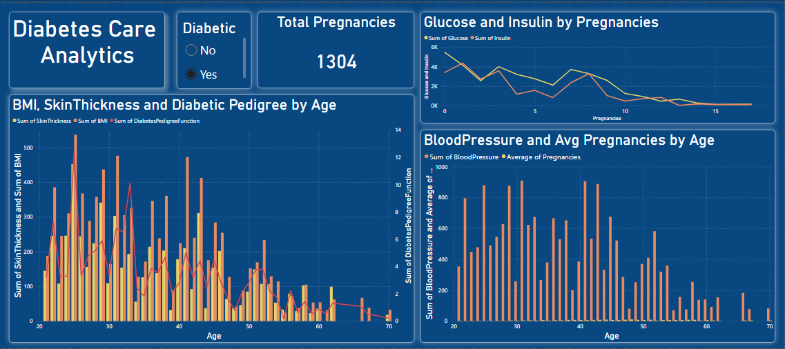

# 🩺 Diabetes Care Analytics Dashboard

## 🚀 Overview
This project features an interactive **Diabetes Care Analytics Dashboard** built using **Power BI**, designed to analyze and visualize key health metrics related to diabetes. The dashboard provides insights into:

- **Total Pregnancies:** Number of recorded pregnancies in the dataset.
- **Diabetic vs. Non-Diabetic Distribution:** Classification of diabetic and non-diabetic individuals.
- **BMI, Skin Thickness & Diabetic Pedigree by Age:** Health factor variations across age groups.
- **Glucose and Insulin by Pregnancies:** Relationship between glucose and insulin levels with pregnancy count.
- **Blood Pressure & Average Pregnancies by Age:** Blood pressure distribution and pregnancy trends across different ages.

---

## 📸 Dashboard Preview

---

## 📂 Dataset
The dataset used for this dashboard is included in the repository:
- **[diabetes.csv](diabetes.csv)**

---

## 🔧 How to Use
1. Download the repository files.
2. Open **Power BI** and load `diabetes.csv`.
3. Explore and interact with the dashboard to gain insights.

---

## 🛠 Tech Stack
- **Power BI** – Data Visualization
- **CSV Data Source** – Diabetes dataset analysis

---

## 📌 Features
✅ Interactive visualizations  
✅ Diabetes vs. Non-Diabetes analysis  
✅ Health factors comparison by age  
✅ Pregnancy count trends  
✅ Clean and intuitive UI  

---

## 📢 Contributing
Want to improve this dashboard? Feel free to fork the repo, make your changes, and submit a pull request!

---

⭐ If you find this project useful, don't forget to give it a **star**! ⭐
